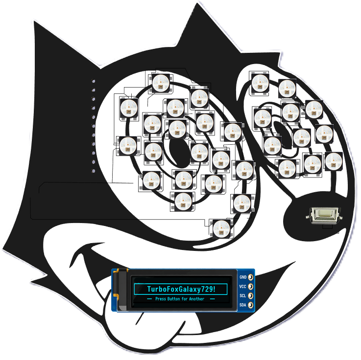

# 🔐 CyberBytes404 RP2040 Password Generator




A fun, educational hardware password generator built with an **RP2040**, **SSD1306 OLED display**, **WS2812B NeoPixel LEDs**, and a push button.

Press the button and the RP2040 generates a new **Strong Password**, displays it on the OLED, and runs a colorful bouncing LED animation.

This project was created as part of **CyberBytes404** to help introduce kids and beginners to cybersecurity, password security, electronics, and MicroPython.

---

## 🚀 Features

- 🔐 Generates a new password at the press of a button
- 💪 Default password strength is **Strong**
- 🖥️ Displays the generated password on a 128×64 SSD1306 OLED
- 🌈 Controls a 30-LED WS2812B NeoPixel strip
- 💡 Runs a bouncing LED animation after generating a password
- 🔘 Simple one-button operation
- 🐍 Written in MicroPython
- 🎓 Designed as an educational cybersecurity project
- ⚡ Runs completely on the RP2040 — no internet connection required

---

## 🧠 How It Works

When the RP2040 starts, the OLED displays a message asking the user to press the button.

When the button connected to **GPIO 7** is pressed:

1. The RP2040 generates a new password.
2. The password is displayed on the OLED.
3. The password is also printed to the MicroPython console.
4. The WS2812B LEDs run a bouncing animation.
5. The system waits for the next button press.

Example passwords might look like:

```text
LuckyDinoGalaxy427!
TurboPandaRocket812@
CosmicDragonCastle391#
NinjaOtterPlanet604$
```

---

# 🧰 Hardware

## Components

| Component | Description |
|---|---|
| RP2040 | Raspberry Pi RP2040-based development board |
| SSD1306 OLED | 128×64 I2C OLED display |
| WS2812B | 30 addressable RGB LEDs |
| Push Button | Generates a new password |
| USB Cable | Power and MicroPython programming |
| Wires | For connecting the components |

---

# 🔌 Pin Connections

## SSD1306 OLED

The OLED uses **I2C0**.

| OLED | RP2040 |
|---|---|
| SDA | GPIO 0 |
| SCL | GPIO 1 |
| GND | GND |
| VCC | Appropriate power pin for your OLED module |

MicroPython configuration:

```python
i2c = I2C(
    0,
    sda=Pin(0),
    scl=Pin(1),
    freq=400000
)
```

---

## 🔘 Push Button

| Button | RP2040 |
|---|---|
| Signal | GPIO 7 |
| Other side | GND |

The button uses the RP2040's internal pull-up resistor:

```python
button = Pin(7, Pin.IN, Pin.PULL_UP)
```

This means:

```text
Button Released = HIGH
Button Pressed  = LOW
```

---

## 🌈 WS2812B NeoPixels

| WS2812B | RP2040 |
|---|---|
| DATA | GPIO 9 |
| GND | GND |
| Power | Appropriate LED power supply |

The current project uses:

```python
LED_PIN = 9
NUM_LEDS = 30
```

> **Important:** The RP2040 and WS2812B power supply should share a common ground.

---

# 📌 Current GPIO Map

| GPIO | Function |
|---:|---|
| GPIO 0 | OLED SDA |
| GPIO 1 | OLED SCL |
| GPIO 7 | Password Generator Button |
| GPIO 9 | WS2812B Data |

---

# 🐍 Software Requirements

The project uses **MicroPython**.

The main modules used are:

```python
from machine import Pin, I2C
import neopixel
import ssd1306
import time
import urandom
```

### SSD1306 Library

Make sure the following file is installed on the RP2040:

```text
ssd1306.py
```

A typical RP2040 filesystem might look like:

```text
/
├── main.py
└── ssd1306.py
```

---

# 🔐 Password Generation

The default password mode is:

## STRONG

Passwords are constructed using:

```text
Adjective + Animal + Place + Number + Symbol
```

For example:

```text
LuckyDinoGalaxy427!
```

This makes passwords easier to read and remember while demonstrating how password length and character variety can improve password strength.

The generator selects words from built-in lists containing adjectives, animals, and places, then adds a random number and symbol.

---

# 🎮 Using the Password Generator

### 1. Power the RP2040

Connect the RP2040 to USB or another appropriate power source.

### 2. Wait for the OLED

The OLED will display the CyberBytes404 password-generator startup screen.

### 3. Press the Button

Press the button connected to:

```text
GPIO 7
```

### 4. Get Your Password

A new password will appear on the OLED.

### 5. Watch the LEDs

The 30 WS2812B LEDs connected to GPIO 9 will run the bouncing LED animation.

### 6. Generate Another

Press the button again whenever you want another password.

---

# 💡 LED Animation

After generating a password, the NeoPixel strip runs a bouncing-light animation.

The light travels:

```text
→ → → → → → → → →

← ← ← ← ← ← ← ← ←
```

The effect cycles through multiple colors before returning control to the password generator.

---

# 🖥️ OLED Display

The project uses a:

```text
128 × 64 SSD1306 OLED
```

Strong passwords can be longer than the number of characters that fit across a single OLED line.

The program can therefore split longer passwords across multiple lines:

```text
CYBERBYTES404
STRONG PASSWORD

LuckyDinoGalaxy
427!

GPIO7 = NEW
```

---

# 📂 Suggested Repository Structure

```text
CyberBytes404-RP2040-Password-Generator/
│
├── README.md
├── main.py
├── ssd1306.py
│
├── images/
│   ├── password-generator.jpg
│   └── wiring-diagram.png
│
└── LICENSE
```

The `images` directory is optional but is useful for adding pictures of the completed project and wiring diagrams to this README later.

---

# 🛠️ Troubleshooting

## OLED Does Not Display Anything

Check that:

```text
SDA → GPIO 0
SCL → GPIO 1
```

Also verify that the OLED appears during an I2C scan.

Example:

```python
from machine import Pin, I2C

i2c = I2C(
    0,
    sda=Pin(0),
    scl=Pin(1),
    freq=400000
)

print(i2c.scan())
```

A common SSD1306 I2C address is:

```text
0x3C
```

---

## Button Does Nothing

Verify:

```text
Button → GPIO 7
Button → GND
```

The code expects:

```python
Pin(7, Pin.IN, Pin.PULL_UP)
```

---

## NeoPixels Do Not Light

Verify:

```text
DATA → GPIO 9
```

Also make sure:

- The LED strip is receiving adequate power.
- The RP2040 and LED power supply share a common ground.
- The data connection is connected to the **DIN** side of the WS2812B strip.

---

# ⚠️ Security Note

This project is intended primarily as an **educational cybersecurity and electronics project**.

It demonstrates concepts such as:

- Password length
- Character variety
- Random password generation
- Memorable passphrase-style passwords
- Embedded hardware programming

For highly sensitive accounts, password-manager-generated credentials and cryptographically secure random-number generation are recommended.

---

# 🎓 Educational Goals

The CyberBytes404 RP2040 Password Generator can be used to introduce students to several concepts at the same time:

**Cybersecurity**

- Why strong passwords matter
- Password length
- Password complexity
- Password reuse
- Password managers

**Electronics**

- GPIO
- Push buttons
- I2C
- OLED displays
- Addressable LEDs

**Programming**

- Python / MicroPython
- Variables
- Functions
- Lists
- Random selection
- Loops
- Hardware control

---

# 🐱 About CyberBytes404

**CyberBytes404** is focused on making cybersecurity and technology education approachable, interactive, and fun for kids and beginners.

Instead of only teaching cybersecurity concepts on a screen, projects like the RP2040 Password Generator combine:

```text
Cybersecurity
     +
Programming
     +
Electronics
     +
Hands-On Learning
```

The goal is to help students understand **how technology works while learning how to use it safely.**

---

# 🛡️ CyberBytes404

### Learn. Build. Explore. Stay Secure.

🔐 Cybersecurity  
🐍 Programming  
🔌 Electronics  
🤖 Technology  
🎓 Education
